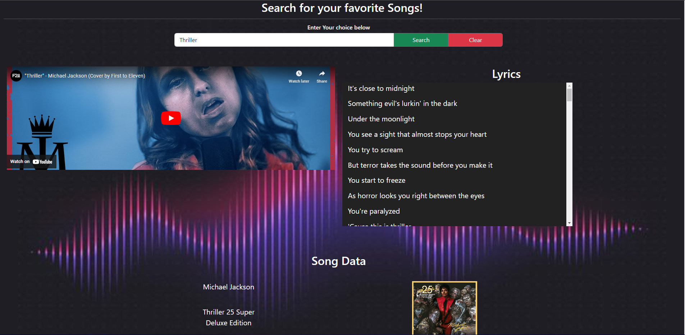

# LyricLookup

Search for your favorite songs displaying video and lyrics

## Description

This Project was created to test our knowledge on API's and everything we have been learning on the road to becoming Full stack web developers.

We came up with the idea that we wanted to build a site that allows a user to search for a song and have it come back with a video and more importantly the lyrics of the song they have searched for. 

Throughout the project we have learned more about working with API's, as well as learning from our challenges since things do not always go as planned. 

## Usage 🏆

In our website the user will be able to input a song that they would like to get the lyrics to and will get back the lyrics to the song and a cover youTube video. The site will give back only a cover to the video due to copyright reasons but the lyrics will be the original lyrics. 

The following image shows the web application's appearance and functionality:
    

## Deployed Website

Click [here](https://brianahlers.github.io/lyriclookup/) to go to the Lyriclookup site. 

## Credits

Brian Ahlers : [brianahlers](https://github.com/brianahlers)  
Caleb Baca : [Caleb-A-B](https://github.com/Caleb-A-B)  
Daniel Longacre : [DanielLongacre](https://github.com/DanielLongacre)  
Nysa Trejo : [nysat](https://github.com/nysat)  
Yehudah Christian : [PapiCLY](https://github.com/PapiCLY)  

## License
Licensed under the [MIT](LICENSE.txt) license.
---

 

